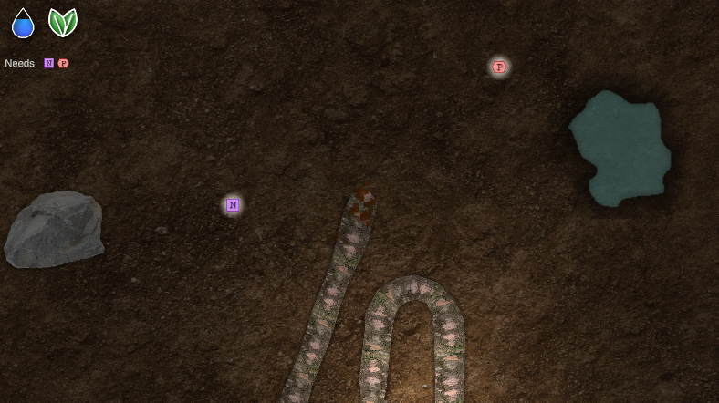
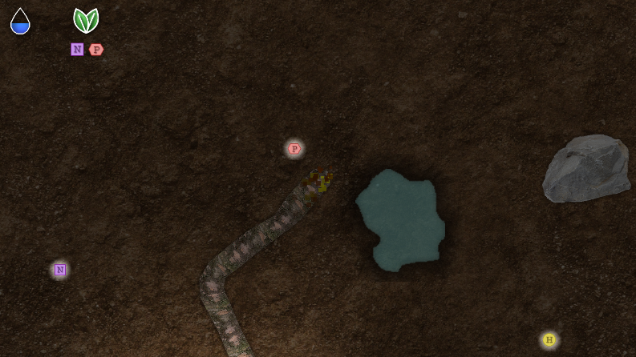
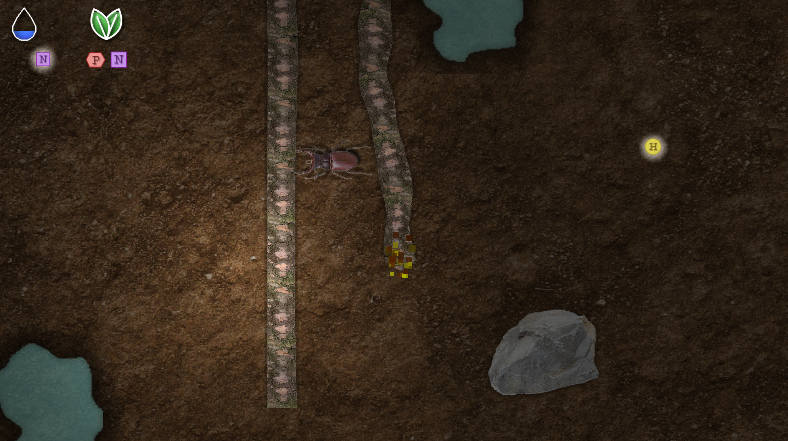

# SNOOT

Developed for the [Global Game Jam'23], theme is "Roots".

# History

2023/02/03 - 14:35: Root code working

2023/02/03 - 15:27: Open world working

2023/02/03 - 16:32: Root texturing and dig effect

2023/02/03 - 17:17: Dig particle system and lights on areas

2023/02/03 - 18:07: Root death on self-intersection

2023/02/03 - 18:32: Added rocks

2023/02/03 - 19:53: Water system

2023/02/04 - 11:00: UI for water, water effect and water generation

2023/02/04 - 13:00: Nutrient system

2023/02/04 - 14:17: Nutrient generation and glowing head

2023/02/04 - 15:40: Branching system and checkpoint

2023/02/04 - 16:49: Insects

2023/02/04 - 18:08: HUD icons

2023/02/04 - 18:08: Far nutrient display 

## License

* All source code by Diogo Andrade is licensed under the MIT license.
* [NaughtyAttributes] by Denis Rizov, available through the MIT license.
* Soil texture by [FabooGuy], free to use (no explicit license)
* Rock images by [FreeIconsPNG], free to use (no explicit license)
* Beetle image by [FreeIconsPNG], free to use (no explicit license)
* UI images from [FlatIcons] (no explicit license)

## Metadata

* Autor: [Diogo Andrade]

[Diogo Andrade]:https://github.com/DiogoDeAndrade
[NaughtyAttributes]:https://github.com/dbrizov/NaughtyAttributes
[Crayon]:https://www.craiyon.com/
[Midjourney]:https://www.midjourney.com/home/
[Global Game Jam'23]:https://globalgamejam.org/
[CC0]:https://creativecommons.org/publicdomain/zero/1.0/
[FabooGuy]:https://www.deviantart.com/fabooguy
[FreeIconsPNG]:https://www.freeiconspng.com/
[FlatIcons]:http://www.flaticons.com
